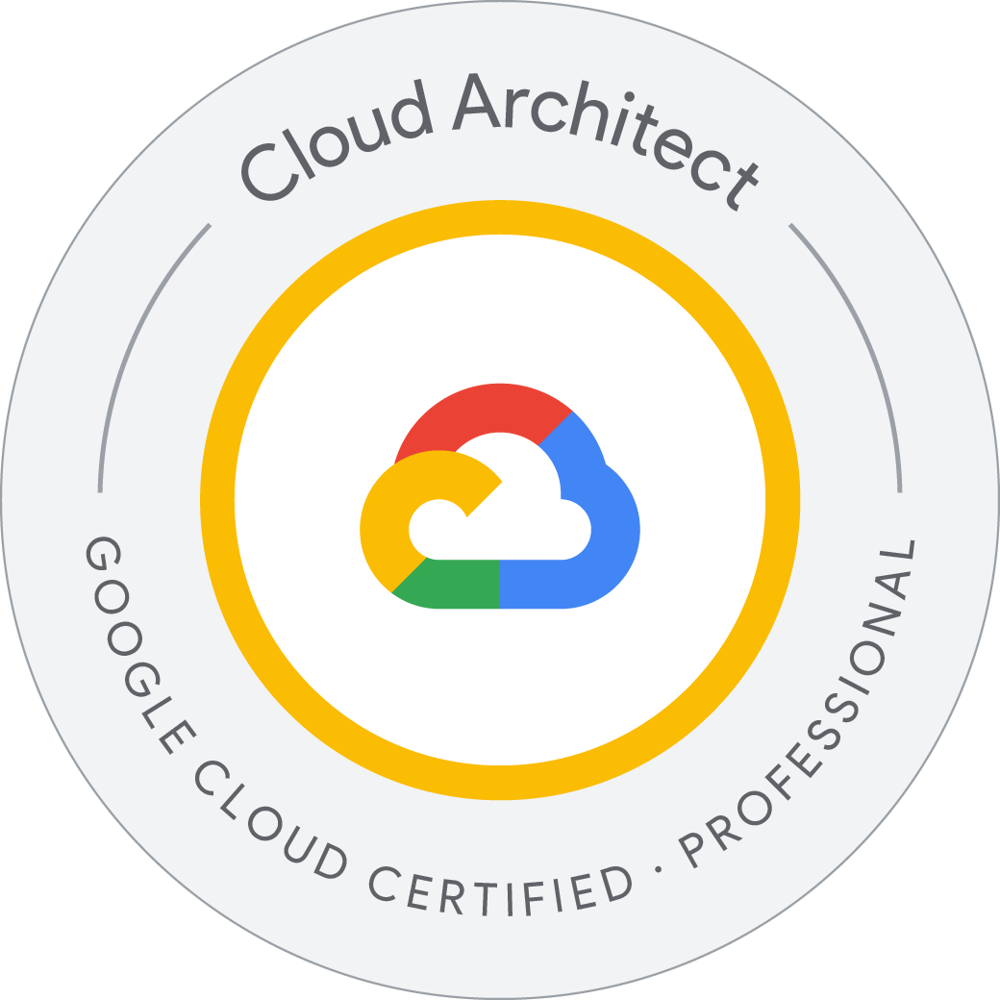
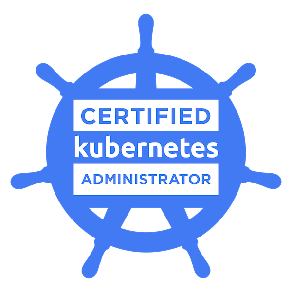
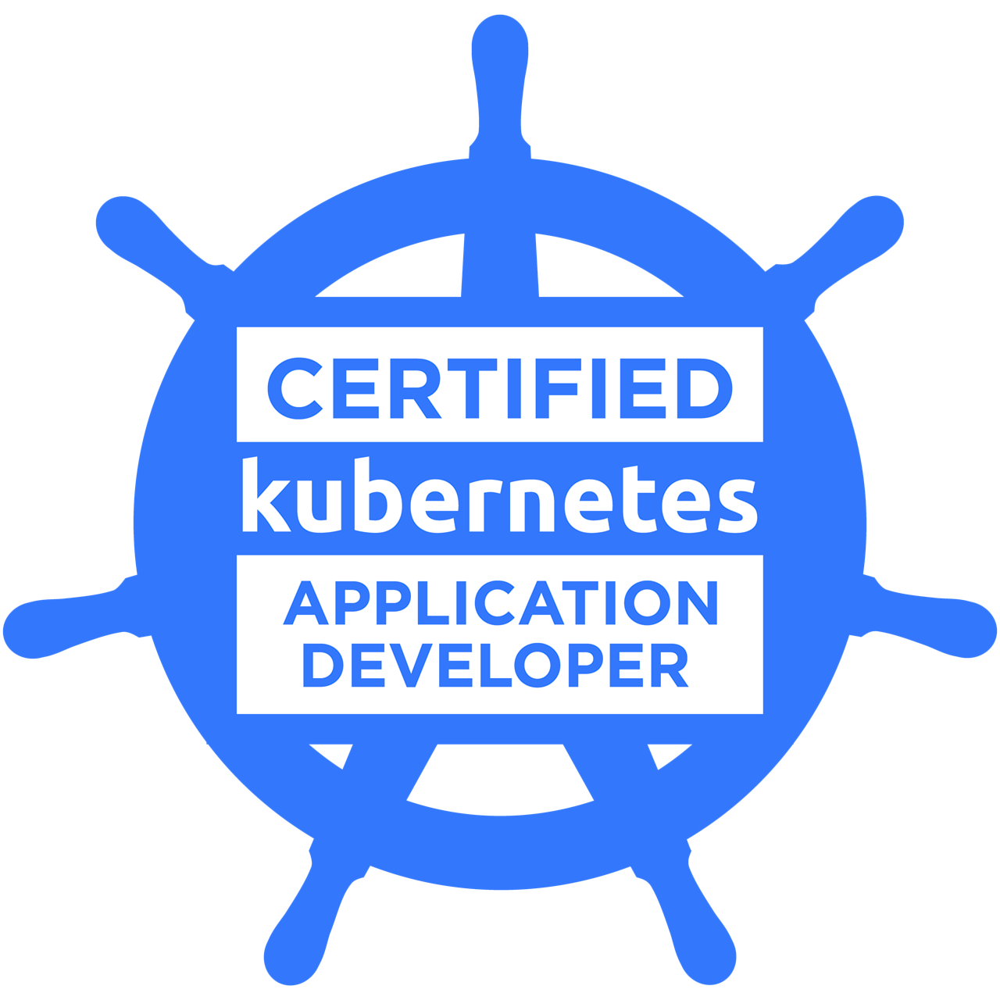
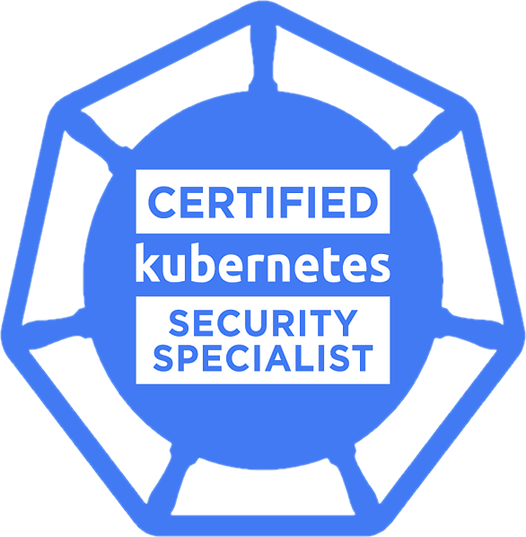
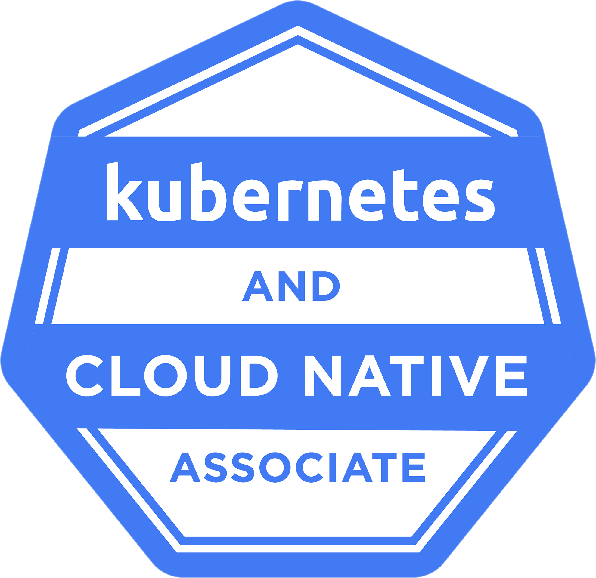
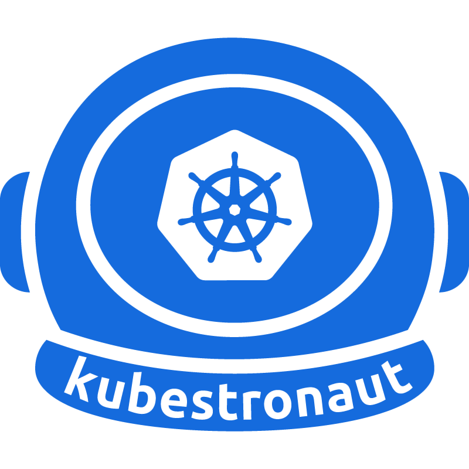

&nbsp;
&nbsp;
&nbsp;
&nbsp;
&nbsp;

<!-- About -->

**Site Reliability Engineer** at [@CyberAgent](https://github.com/CyberAgent) / **Platform Engineer** at [@ABEMA](https://github.com/AmebaTV)

<!-- Stats -->

 

&nbsp;

  

<!-- Tech Stack -->

### Tech Stack

&nbsp;
&nbsp;
&nbsp;
&nbsp;
&nbsp;
&nbsp;
&nbsp;
&nbsp;
&nbsp;
&nbsp;
&nbsp;
&nbsp;

<!-- Certifications -->

### Certifications

**Google Cloud**

&nbsp;
&nbsp;
&nbsp;
&nbsp;
&nbsp;
&nbsp;
&nbsp;
&nbsp;

 

**Kubernetes / CNCF**

&nbsp;
&nbsp;
&nbsp;
&nbsp;
&nbsp;

<!-- Publications -->

### Publications

  &emsp;
  &emsp;
  &emsp;
  &emsp;
  

 

